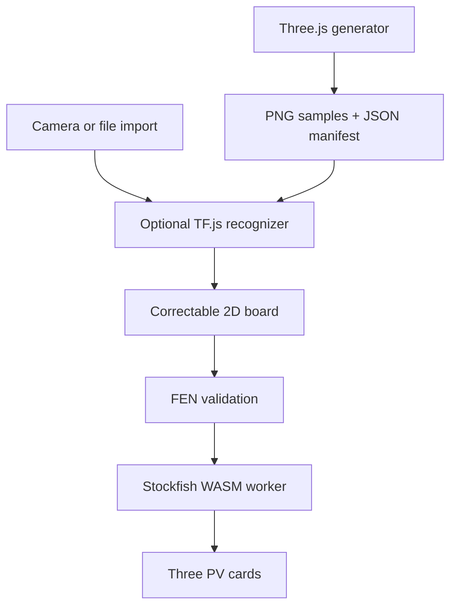

# Chess Vision Cross-Platform - Plan

## Goal Capsule

- **Objective:** Replace the Android-only application with a mobile-first React web app that turns a photographed chessboard into a correctable digital position and shows three Stockfish principal variations.
- **Product authority:** The user-directed product shape is a chess.com-adjacent visual language, camera or image import, ML-assisted position capture, manual correction, engine analysis, and a Three.js-generated labeled training dataset.
- **Open blockers:** A production piece-recognition model is not yet trained or supplied; the first release must make that state explicit while keeping the model contract and correction workflow usable.

---

## Product Contract

### Summary

Chess Vision will be a responsive installable web app that feels familiar to chess.com users without copying its assets or identity. A player captures or imports a board photo, reviews the inferred position on an interactive 2D board, corrects it when necessary, and requests three local Stockfish lines from the resulting FEN.

The same repository will include a browser-based Three.js studio that renders varied boards, piece sets, camera angles, lighting, and positions with paired ground-truth labels, so a trained model can replace the initial inference seam without changing the player flow.

### Problem Frame

Physical-board analysis is useful only if the resulting position is trustworthy. Automatic recognition therefore accelerates capture but never becomes a silent source of truth: the player sees and can correct the board before engine analysis.

### Requirements

**Capture and recognition**

- R1. The app supports taking a photo from a mobile camera and importing an image file on Android and iOS browsers.
- R2. The app displays capture progress, image preview, model availability, and recoverable recognition failures clearly.
- R3. A pluggable browser ML recognizer consumes a board image and returns an 8x8 position with per-square confidence when a compatible model is available.
- R4. When no model is installed or inference is inconclusive, the app starts from an explicitly empty, editable board rather than fabricating a recognised position.

**Position verification**

- R5. The player can place, replace, and clear every standard chess piece on a responsive 2D board before analysis.
- R6. The board exposes orientation, side-to-move, and the generated FEN so the player can validate the position.
- R7. The app prevents analysis of positions that fail basic king and FEN validity checks, while explaining what needs correction.

**Engine analysis**

- R8. The app runs Stockfish locally in the browser through WebAssembly and displays the top three principal variations for the verified FEN.
- R9. Each line shows rank, evaluation, depth, and move sequence; analysis failures remain recoverable without losing the corrected board.

**Synthetic training data**

- R10. A Three.js generator creates chessboard images with varied piece styles, board materials, camera pose, lighting, and legal-looking piece arrangements.
- R11. Every generated sample includes machine-readable ground truth for the complete board position and its FEN.
- R12. The generator can batch-download a dataset manifest and rendered samples for offline model training.

**Experience and delivery**

- R13. The primary mobile flow is fast, touch-friendly, and visually continuous with chess.com’s dark, green-accented chess aesthetic without using its trademarks or copied artwork.
- R14. The app is usable as a responsive PWA in current mobile Safari and Chrome, with accessible controls and a desktop layout for dataset creation.
- R15. The repository documents how to run the app, create synthetic data, train/export a compatible model, and place the model for local inference.

### Key Decisions

- **PWA over separate native apps:** A single React web application reaches Android and iOS through modern camera and file APIs while keeping the dataset studio and inference runtime in one codebase. Native app-store packaging is deferred.
- **Correction-first capture:** Recognition is an assistive draft, not final truth; user correction gates engine analysis because a plausible-looking but incorrect board has low analytical value.
- **Local-first analysis:** Stockfish runs in the client so an uploaded chessboard image and position do not require a third-party analysis service.
- **Synthetic data as a first-class tool:** The generator ships with the product rather than remaining an undocumented training script, making the labeled-data contract inspectable and repeatable.

### Key Flows

- **F1. Capture to analysis:** A player opens the app, takes or imports a board photo, receives an ML draft or an honest unavailable-model state, corrects the position, and sees three engine lines for the generated FEN.
- **F2. Dataset creation:** A model builder opens the generator, chooses a sample count and visual variation, generates labeled board renders, and downloads the samples plus manifest for training.

### Acceptance Examples

- AE1. On an iPhone or Android browser, selecting the camera action opens an image capture affordance; selecting import accepts a supported image file.
- AE2. With a compatible model installed, inference results populate the review board and visually distinguish lower-confidence squares.
- AE3. Without a model, the player sees an empty editable board and an explanation that manual correction is required; no pieces are invented.
- AE4. After a valid corrected board is analyzed, exactly three ordered engine-line cards are shown with evaluation and PV moves.
- AE5. A generated dataset download contains image files and a manifest whose labels reconstruct each rendered board and FEN.

### Scope Boundaries

**Deferred for later**

- Training, hosting, evaluating, and continuously improving a production model.
- Automatic board-corner detection and perspective rectification beyond the compatible-model contract.
- Game history, accounts, cloud sync, social play, and opening databases.
- Native App Store / Play Store wrappers.

**Outside this product’s identity**

- Copying chess.com branding, visual assets, or proprietary features.
- Claiming that an untrained or unavailable model has recognised the photographed board.

### Dependencies and Assumptions

- A browser-compatible Stockfish WebAssembly package and a compatible exported TensorFlow.js model are available during development.
- Camera access depends on HTTPS or localhost and the player granting browser permission.
- Synthetic renders establish useful ground truth, but real-world accuracy still requires training and validation against real board photos.

### Success Criteria

- A player can complete capture/import, correction, and three-line analysis on a mobile-sized viewport without a native Android build.
- The app never conceals missing-model or low-confidence recognition states.
- A developer can generate a labeled synthetic dataset and follow documented steps to connect a trained model to the app.

---

## Planning Contract

### Technical Direction

The legacy Gradle/Android project will be removed in this branch and replaced at the repository root by a TypeScript React PWA built with Vite. The application will be deliberately client-only: browser camera/file APIs supply the image, TensorFlow.js loads an optional exported classifier, Stockfish 18 WebAssembly runs in a worker, and all correction and analysis state stays in the browser.

The recognizer boundary will return a `BoardRecognition` result rather than allowing UI code to depend on a model tensor shape. It must return an explicit unavailable state when `public/models/chess-piece/model.json` is absent. The review experience starts with a valid editable empty board in that case, preserving the correction-first product decision.

The generator will use Three.js for deterministic, downloadable renders and its own serialisable board state. It will not promise that synthetic output alone is a validated production training set.

### Key Technical Decisions

- **KTD-1. Replace the Android build wholesale with a Vite React PWA.** This is a true cross-browser product surface and prevents a second native UI implementation from diverging.
- **KTD-2. Make model absence a typed result.** The UI must distinguish unavailable model, failed image preprocessing, partial low-confidence result, and successful result so users can judge the position draft correctly.
- **KTD-3. Run Stockfish behind a worker adapter.** UCI message parsing, multi-PV collection, cancellation, and engine loading remain outside React components, avoiding UI freezes on mobile devices.
- **KTD-4. Generate full-board manifests.** Each image entry records FEN, square map, seed, and render configuration, which supports future board-level or per-square training without regenerating ground truth.
- **KTD-5. Use original procedural piece geometry and CSS tokens.** The chess.com-adjacent feel comes from familiar proportions, dark surfaces, muted green accents, and board interaction patterns—not copied assets or branding.

### Architecture

### Implementation Units

### U1. Replace the repository scaffold with a React PWA

- **Goal:** Remove the legacy Android/Gradle application surface and establish a typed, installable React project with development, production, and test commands.
- **Files:** `package.json`, `vite.config.ts`, `tsconfig.json`, `index.html`, `src/main.tsx`, `src/styles.css`, `src/vite-env.d.ts`, `public/manifest.webmanifest`, `public/icons/*`, delete `app/`, `gradle/`, `training/`, Gradle root files, and Android-specific documentation.
- **Patterns:** Keep the repository root as the app root; use Vite’s PWA integration for manifest and service worker generation; exclude local models and generated datasets from Git.
- **Test scenarios:** Build succeeds; unit-test runner discovers a smoke test; manifest declares standalone mobile use; generated data and model artifacts remain ignored.
- **Verification:** `npm run build` and `npm run test` pass.

### U2. Build the capture-to-review chess interface

- **Goal:** Create the responsive chess.com-inspired shell, camera/file capture controls, image preview, status notices, accessible interactive board, piece palette, orientation control, FEN output, and validity gating.
- **Files:** `src/App.tsx`, `src/components/CapturePanel.tsx`, `src/components/ChessBoard.tsx`, `src/components/PiecePalette.tsx`, `src/components/AnalysisPanel.tsx`, `src/components/StatusNotice.tsx`, `src/lib/chess.ts`, `src/lib/position.ts`, `src/styles.css`, `src/lib/chess.test.ts`, `src/components/ChessBoard.test.tsx`.
- **Patterns:** Model the position as 64 standard piece codes plus side-to-move; derive FEN and validation from pure functions; keep touch targets large and keyboard interactions explicit.
- **Test scenarios:** Piece placement/replacement/clear actions update the FEN; orientation changes labels but not board state; a missing king blocks analysis; valid kings enable analysis; file input and camera input accept images.
- **Verification:** Run component and pure-function tests, then test the mobile capture flow in a browser.

### U3. Add optional browser ML recognition with truthful fallbacks

- **Goal:** Load a compatible TensorFlow.js model, classify a canonical 8x8 input when present, surface confidence, and return an explicit manual-correction state otherwise.
- **Files:** `src/services/recognition.ts`, `src/services/image-grid.ts`, `src/services/recognition.test.ts`, `public/models/README.md`, `src/App.tsx`.
- **Patterns:** Use a documented model metadata contract for class labels, input size, normalisation, and square orientation; isolate image decoding and tensor disposal; make unavailable/error outcomes data rather than exceptions leaked into the UI.
- **Test scenarios:** Missing model returns `unavailable`; a mocked model result maps all 13 labels to expected piece codes; low-confidence squares are reported; malformed image produces recoverable failure; tensor cleanup is exercised through the adapter boundary.
- **Verification:** Run unit tests and manually confirm the board starts empty and editable when the model file is absent.

### U4. Integrate Stockfish multi-PV analysis

- **Goal:** Run Stockfish 18 WebAssembly in a Web Worker, request `MultiPV 3`, parse UCI info/bestmove messages, and render ordered evaluation lines for a valid FEN.
- **Files:** `src/services/stockfish.ts`, `src/workers/stockfish.worker.ts`, `src/services/stockfish.test.ts`, `src/components/AnalysisPanel.tsx`, `src/App.tsx`.
- **Patterns:** Provide a small worker-client interface with loading, analyzing, complete, error, and cancelled states; convert centipawn and mate scores to player-readable output; discard stale responses when a newer run starts.
- **Test scenarios:** Parsed UCI output yields three ordered PVs; mate and centipawn scores format correctly; invalid FEN never reaches the worker; cancellation suppresses stale results; worker load failure leaves the corrected board intact.
- **Verification:** Run tests and smoke-test three lines from a known legal position in a browser build.

### U5. Create the Three.js synthetic dataset studio

- **Goal:** Let a desktop user render varied chessboard scenes and download PNG samples with a ground-truth manifest containing FEN, square map, seed, and scene settings.
- **Files:** `src/studio/DatasetStudio.tsx`, `src/studio/scene.ts`, `src/studio/generator.ts`, `src/studio/manifest.ts`, `src/studio/generator.test.ts`, `src/App.tsx`, `src/styles.css`.
- **Patterns:** Use a seeded random generator; construct original simple piece meshes and board materials in Three.js; guarantee that the board state and written manifest share one source of truth; batch work cooperatively to retain responsive controls.
- **Test scenarios:** A fixed seed produces stable labels; generated FEN round-trips through the shared position library; manifests have one entry per image and a complete 64-square map; download packaging is invoked with all generated assets.
- **Verification:** Run generator tests and manually download a small dataset, inspecting both image count and manifest labels.

### U6. Document the model and dataset handoff

- **Goal:** Make the replacement project runnable and explain the full path from synthetic images through model export to local browser inference.
- **Files:** `README.md`, `public/models/README.md`, `.gitignore`.
- **Patterns:** State browser permissions and HTTPS requirements, model limitations, class mapping, dataset schema, commands, and verification instructions in user-facing language.
- **Test scenarios:** Documentation commands match package scripts; ignored paths cover model binaries and generated dataset output.
- **Verification:** Follow the README from a clean dependency install through build and test.

### Dependency Order

1. U1 establishes the new project boundary and test tooling.
2. U2 provides the correction-first product flow and shared chess domain utilities.
3. U3 and U4 build independently on the shared position contract, then integrate into U2.
4. U5 reuses the shared chess domain model after it is proven by U2.
5. U6 finalizes the public handoff after all runtime and generator contracts are established.

### Verification Contract

| Gate | Applies to | Done signal |
| --- | --- | --- |
| Typecheck | U1-U5 | `npm run typecheck` completes without errors. |
| Unit/component tests | U1-U5 | `npm run test` verifies chess state, recognizer, Stockfish parsing, and generator manifest behavior. |
| Production build | U1-U6 | `npm run build` produces the PWA bundle. |
| Browser smoke test | U2-U5 | Mobile capture/import, correction, no-model state, sample engine lines, and a dataset download work in a browser. |

### Definition of Done

- The tracked source tree is a React PWA, not an Android Gradle application.
- Capture/import, correction, valid-FEN gating, and the three-line engine presentation are usable on mobile layouts.
- A missing model produces an honest correction-first experience, while a documented TF.js model contract enables real inference.
- The Three.js studio produces rendered samples and auditable labels.
- Tests, typecheck, and a production build pass, and the README documents local use and model-data handoff.

### Risks and Mitigations

- **Model accuracy is not deliverable without trained weights:** Keep the model contract explicit and never equate a fallback board with recognition.
- **Mobile engine performance varies:** Limit default depth/time, run in a worker, allow cancellation, and make results non-blocking.
- **Browser camera support is permission and HTTPS dependent:** Retain the image-file path and document the requirement.
- **Synthetic-to-real domain gap can harm accuracy:** Record visual parameters in every label and validate trained models on real photos before promoting them.
