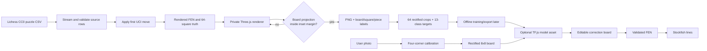

# Accurate Chess Training Pipeline - Plan

## Goal Capsule

Replace the browser-visible, primitive synthetic-data demo with a private offline Three.js synthetic-data foundation that emits correctly framed, source-traceable chessboard images and exact training labels. Make the app reject incomplete board photographs before recognition or engine analysis.

**Product authority:** the user's correction that a complete real board is mandatory, synthetic work is not a customer feature, and rendered positions must come from a puzzle database overrides the prior Dataset Studio design.

**Stop conditions:** do not claim scanned-asset photorealism without licensed assets and real-photo evaluation; do not run an uncalibrated or partial photo through recognition; do not emit an image when its label projection cannot prove full-board framing.

**Execution profile:** preserve the existing React PWA for users; place the generator and its output outside the production bundle; retain the legacy YOLO files as separate reference data until a later migration decision.

---

## Product Contract

### Summary

Chess Vision will accept only a complete, user-calibrated board image, rectify it into the model's canonical grid, and keep the correction step ahead of engine analysis. Developers will generate private synthetic training samples from verified Lichess puzzle positions with their labels derived from the same rendered FEN.

### Problem Frame

The current sample can crop the board, contains simplistic piece silhouettes, and has annotations unrelated to the perspective render. Its apparent positions are random legal playouts rather than curated puzzle positions. Training on those images would teach a model the wrong geometry and leave no reliable way to assess a partial real-world photo.

### Requirements

#### Capture and interpretation

- R1. The app must require a visible, complete 8x8 board before it can call recognition or enable engine analysis.
- R2. The capture flow must let a user place or adjust four outer board corners, reject invalid/incomplete quadrilaterals, confirm orientation, and show a recoverable retake path.
- R3. A successful calibration must produce a rectified board image with a documented white-at-bottom square convention for model preprocessing.
- R4. The editable board remains the source of truth for analysis; the engine must refuse structurally invalid positions and use explicit defaults for photo-unobservable FEN fields.

#### Private synthetic training data

- R5. Synthetic generation must be developer-only: it must not be imported by the React PWA, exposed in the UI, or included in production assets.
- R6. Every rendered position must originate from a validated Lichess puzzle record, with the rendered position formed by applying the record's first UCI move as Lichess specifies.
- R7. The pipeline must render five distinctly modelled chess-set styles with high-detail Three.js geometry, physically based materials, varied table/context, lighting, and camera conditions.
- R8. Every accepted image must show the complete board with a configurable pixel margin, and must carry exact projected board/square/piece labels derived from its rendered FEN and scene.
- R9. The offline dataset must create at least 50 unique source puzzle records whose derived rendered FENs are also unique, and be reproducible from a source version, configuration, and seed.

### Acceptance Examples

- AE1. When a user cannot place and affirm all four visible physical outer-board corners, including for the supplied cropped-board example, the app explains that the whole board is required and cannot invoke recognition or analysis.
- AE2. When a user confirms a convex four-corner calibration and orientation, the app rectifies the image into the canonical grid, then either performs installed-model inference or truthfully presents the editable-board fallback.
- AE3. When the source tool selects a Lichess CSV row, it applies the first UCI move, rejects failures, and records the exact resulting FEN and source puzzle ID in its manifest.
- AE4. When a scene camera would crop a board corner or violate its inset margin, the generator rejects and resamples it rather than writing an image or label.
- AE5. For every completed sample, rebuilding the piece-placement field from the 64 square labels equals the rendered FEN's piece-placement field, the stored full FEN validates independently, and every annotated piece's square/type agrees with that board.
- AE6. A production build has no Dataset Studio route, control, import, or training renderer asset.

### Scope Boundaries

#### In scope

- A manual four-corner calibration gate, deterministic rectification, orientation confirmation, corrected FEN validation, and correction-first engine handoff.
- A private training CLI, high-detail procedural Three.js set models, reproducible Lichess-puzzle selection, full-board render validation, and JSONL/PNG labels.
- A versioned 13-class square-classification data contract: empty plus the twelve colour-and-piece classes, alongside board and instance annotations.

#### Deferred to Follow-Up Work

- Automatic board-corner detection, model training/hyperparameter tuning, TF.js weight export, and measured evaluation against the legacy real-photo/YOLO corpus.
- Replacing the legacy Roboflow/YOLO data under `scripts/` and `runs/`, which remains a migration reference rather than input to the new contract.
- Acquisition of separately licensed/scanned third-party GLB sets beyond the five original procedural models. A GLB asset registry and loader belong to that follow-up, not this five-factory implementation.
- App Store and Google Play packaging, signing, and release work. The existing PWA remains the user-facing surface during this data-quality change.
- Training a production recognition model and evaluating it against held-out real-board photographs. Recognition must continue to identify an unavailable model as unavailable until that gate passes.

#### Outside this change

- Presenting synthetic generation, raw source puzzles, or downloadable datasets to app users.
- Claiming that generated data alone makes recognition reliable on arbitrary real boards.

### Dependencies and Risks

- The Lichess puzzle export is a large CC0 `.csv.zst` download. The source selector must stream and stop after its deterministic sample rather than commit the corpus, while storing the export URL/version/checksum used.
- Headless rendering requires a locally available Chrome/Chromium executable. The runner must preflight the browser path and fail clearly rather than silently using a different renderer.
- High-detail procedural geometry and PBR texture variation will materially improve over the current primitives but is not a substitute for a real-photo validation set or scanned licensed models.

---

## Planning Contract

### Key Technical Decisions

- KTD1. Require user-assisted four-corner calibration before recognition, rather than accepting a partial image or pretending automatic detection exists. (session-settled: user-directed — chosen over accepting uncropped input: the app requires a photo of the complete chessboard.)
- KTD2. Move all synthetic generation to a private offline tool, rather than retaining the Dataset Studio screen. (session-settled: user-directed — chosen over browser downloads: generated samples are training infrastructure, not an app feature.)
- KTD3. Source render positions from Lichess puzzle records and apply the documented first move, rather than use deterministic random legal playouts. (session-settled: user-directed — chosen over fabricated legal-looking positions: puzzle positions provide known accurate chess states.)
- KTD4. Replace the primitive lathe/sphere/cone set with five detailed Three.js model families and PBR scene variation, rather than merely recolouring the existing meshes. (session-settled: user-directed — chosen over low-detail primitive pieces: the current pieces are unsuitable for realistic training imagery.)
- KTD5. Train the first model as a 64-cell, 13-class classifier on the rectified board, not an unconstrained full-image detector. Calibration rectifies the board plane, while the generator limits camera tilt and projected piece displacement so a tall piece never creates an ambiguous square target; rejected poses are not training data.
- KTD6. Use an offline `puppeteer-core` headless-Chromium runner with Three.js WebGL for rendering, not a browser UI or a platform-specific WebGL shim. It serves a private renderer page from loopback, pins `deviceScaleFactor: 1`, waits for an explicit completion payload, and preserves a single canvas-pixel coordinate system for labels and PNGs.
- KTD7. Default castling rights and en-passant to unavailable after a photo, expose them as correction controls, and require static legality validation before Stockfish. The gate checks king/check-state consistency and asserted castling compatibility in addition to FEN structure; a single image cannot reliably determine move history.

### Assumptions

- A local Chrome, Edge, or Chromium executable is available to the developer running the generator; the command supports an explicit executable path when discovery fails. The renderer must still preflight actual WebGL2 shader compilation and pixel readback before a run can proceed.
- The first dataset run uses 50 unique source puzzles and multiple deterministic scene variants. It creates a useful seed corpus, not enough diversity to claim final-model readiness.
- The four-corner calibration is the v1 product boundary. Automatic corner prediction is intentionally not implied by a model-load success.

### High-Level Technical Design

### Data Contract

Each JSONL manifest entry will include a sample ID, generator version, seed, source export metadata, puzzle ID, source FEN, move sequence, rendered FEN, full FEN fields, orientation, image dimensions, board quadrilateral, 64 projected square quadrilaterals, exact 64-square map, and scene camera/light/material metadata. Each piece annotation will include colour, class, algebraic square, full/visible bounding boxes, world transform, and occlusion state. A required deterministic object-ID mask pass records instance segmentation and is the only source for visible boxes and occlusion values.

The `model-contract.json` will pin rectified RGB dimensions, white-at-bottom ordering, 64-cell traversal order, class IDs, normalisation, model input shape, and confidence semantics. The render configuration will pin maximum camera tilt and an ID-mask-derived piece-displacement/overlap threshold; samples that make a square target visually ambiguous must be rejected. Dataset validation must reject labels that cannot satisfy this contract.

### System-Wide Impact

Removing the Studio changes production dependency boundaries: Three.js, JSZip, and browser rendering no longer belong to the PWA dependency graph. The tool will own rendering-only dependencies. Capture state becomes a prerequisite of recognition; recognition remains honest about unavailable weights, and Stockfish receives only a corrected, validated FEN.

### Sources and Research

- [Lichess Open Database](https://database.lichess.org/) documents its puzzle CSV columns, CC0 licence, and that the presentable puzzle position is after the first move in `Moves`.
- [Three.js WebGLRenderer documentation](https://threejs.org/docs/pages/WebGLRenderer.html) confirms the renderer contract used by the headless scene runner.
- [Three.js GLTFLoader documentation](https://threejs.org/docs/pages/GLTFLoader.html) is the future-compatible asset-loader path for approved scanned/GLB sets.
- Current repository evidence: `src/studio/generator.ts` emits primitive meshes and hard-coded image corners; `src/studio/positions.ts` creates random playouts; `src/services/recognition.ts` does not yet crop or infer; `src/App.tsx` exposes Dataset Studio.

---

## Implementation Units

### U1. Remove the production Dataset Studio

**Goal:** Remove the browser-facing generator and leave the PWA focused on capture, correction, and analysis.

**Requirements:** R5, AE6; KTD2.

**Dependencies:** None.

**Files:** `src/App.tsx`, `src/styles.css`, `src/studio/generator.ts` (delete), `src/studio/positions.ts` (delete), `src/studio/chessSets.ts` (delete), `package.json`, `package-lock.json`, `README.md`, `.gitignore`.

**Approach:** Delete Dataset Studio state, controls, imports, and styles. Move any render-only dependencies out of the production dependency graph. Describe the private tool in the README and ignore its generated images/manifests without ignoring its source/configuration.

**Test scenarios:** Production source search finds no Dataset Studio import or route; the built asset manifest contains no training renderer module; the normal capture/editor path still renders.

**Verification:** A production build succeeds and the app no longer exposes a dataset-generation control.

### U2. Gate capture with calibrated full-board geometry

**Goal:** Convert a user photo into a validated, rectified board only after the complete board has been identified by four corners.

**Requirements:** R1, R2, R3, AE1, AE2; KTD1.

**Dependencies:** U1.

**Files:** `src/App.tsx`, `src/components/BoardCalibration.tsx`, `src/components/BoardCalibration.css`, `src/lib/boardGeometry.ts`, `src/lib/boardGeometry.test.ts`, `src/services/recognition.ts`, `src/services/recognition.test.ts`.

**Approach:** Add a calibration state machine for acquisition/loading/error, EXIF-normalised image, four ordered outer-corner targets, orientation confirmation, valid rectification, model result, correction, and retake. The `CalibratedCapture` contract carries normalised source pixels, ordered intrinsic-image corners, orientation, rectified image, and 64 crop geometry; `recogniseBoard` accepts only that contract. Use an inverse-homography Canvas/ImageData sampler to rectify to the model dimensions and split its 8x8 cells.

The UI must guide the user through numbered outer corners, an explicit confirmation that every physical outer edge is visible, a labelled `a1`/`h8` orientation preview, and an editable back action. Convexity, bounds, minimum area, visible-edge affirmation, and correctly ordered corners are required before continuation; this manual gate does not claim automatic physical-board detection. Use draggable touch targets of at least 44px, active-corner instructions, undo/reset/retake, zoom or magnifier support, keyboard nudges or coordinate inputs, visible focus, and `aria-live` errors. Preserve the source/rectified preview, distinguish model-inferred and manually changed squares, flag low-confidence squares when weights are present, and show the empty editable fallback when they are not.

**Execution note:** Start with geometry tests that reject the supplied cropped-board shape and malformed quads before connecting the UI.

**Test scenarios:** Four affirmed outer corners yield a rectified 8x8 board; deliberate selection of an inner quad on the cropped fixture cannot satisfy the visible-edge condition; missing, duplicate, self-crossing, out-of-bounds, and too-small quads reject with a retake state; camera permission denial, picker cancellation, decode failure, unsupported image, and EXIF rotation recover before calibration; both orientations map square labels deterministically and show the correct preview; touch, keyboard, and screen-reader instructions can complete or reset a calibration; recognition receives only a `CalibratedCapture`; an absent model remains an editable fallback after successful calibration.

**Verification:** In a browser smoke check, a partial photo cannot invoke recognition or analysis, while a calibrated complete board reaches the correction editor.

### U3. Make corrected FEN analysis structurally safe

**Goal:** Ensure Stockfish only receives an explicit, structurally valid position after human correction.

**Requirements:** R4; KTD7.

**Dependencies:** U2.

**Files:** `src/lib/position.ts`, `src/lib/position.test.ts`, `src/App.tsx`, `src/services/stockfish.ts`, `src/services/stockfish.test.ts`.

**Approach:** Extend position state and controls to carry side to move, castling rights, and en-passant policy. Build the full FEN from those values and validate king count, king adjacency, pawn placement, turn, FEN syntax, incompatible castling assertions, and attack-state consistency before analysis. Make analysis return up to three available engine lines, including a terminal/no-legal-moves state, rather than promising three for every possible board.

**Test scenarios:** Valid calibrated/corrected boards produce the selected FEN; king adjacency, pawns on back ranks, both kings in check, a non-active king in check, invalid castling assertions, and malformed en-passant states block engine calls; unknown photo history defaults visibly to no castling/no en-passant until corrected; a terminal position reports no lines; the worker receives the exact full FEN.

**Verification:** Unit tests prove FEN construction/validation and a worker fixture proves the analysis adapter receives only approved positions.

### U4. Build a traceable Lichess puzzle source stage

**Goal:** Select at least 50 distinct, legal source positions from the official puzzle export without embedding a giant third-party corpus in the repository.

**Requirements:** R6, R9, AE3; KTD3.

**Dependencies:** None.

**Files:** `training/README.md`, `training/requirements.txt`, `training/source/fetch_lichess_puzzles.py`, `training/source/test_puzzle_source.py`, `training/config/dataset.v1.json`, `training/package.json`, `training/package-lock.json`, `.gitignore`.

**Approach:** Make the Python source tool the single executable owner for download, zstd streaming, FEN validation, and UCI application. Pin `zstandard` and `python-chess` in `training/requirements.txt`; use the configured CC0 export URL, response ETag/content version, selection seed, and source-manifest digest for provenance. Stream only until the deterministic selection has 50 eligible puzzle IDs with 50 distinct derived rendered FENs, then write a compact JSON input manifest for the Node renderer. Reject corrupt downloads, decompression failures, malformed rows, invalid FEN/UCI, duplicate puzzle IDs, duplicate derived FENs, terminal positions, and fewer-than-50 results. The script must never present input rows as renders before that move is applied.

**Test scenarios:** Known fixture row applies its first UCI move to the expected render FEN; malformed FEN/UCI, duplicate puzzle ID, duplicate derived FEN, corrupt compression, and insufficient eligible input reject; 50 selected records have unique IDs and derived FENs; generated source metadata includes export URL/version, response ETag, selection digest, and CC0 licence.

**Verification:** The source command writes a 50-position manifest whose every rendered FEN is independently validated by `chess.js`.

### U5. Create five detailed Three.js set families and verified scene labels

**Goal:** Render full-board, materially varied training images from the exact source FEN with trustworthy projection labels.

**Requirements:** R7, R8, R9, AE4, AE5; KTD4, KTD5, KTD6.

**Dependencies:** U4.

**Files:** `training/scene/chess-set-factories.mjs`, `training/scene/materials.mjs`, `training/scene/board-scene.mjs`, `training/scene/projection.mjs`, `training/scene/label-schema.mjs`, `training/scene/label-schema.test.mjs`, `training/renderer/index.html`, `training/renderer/main.mjs`, `training/run-render.mjs`, `training/run-render.test.mjs`, `training/model-contract.json`, `training/config/dataset.v1.json`, `training/package.json`, `training/package-lock.json`.

**Approach:** Model five original set families—Walnut Staunton, Carrara Marble Staunton, Minimal Ceramic, Ornate Ebony/Brass, and Boxwood Tournament—with distinct profiles, collars, bishop mitres, rook crenellations, king finials, and bevelled knight silhouettes. Keep the five set definitions as a typed factory map; do not introduce a future GLB registry in this change. Apply deterministic PBR wood/marble/ceramic/ebony variation, board/table context, HDR/environment or key-fill-rim lighting, shadows, exposure, and camera variation.

Pin `three`, `puppeteer-core`, and `chess.js` in `training/package.json`. Use `puppeteer-core` to launch an explicitly resolved local Chrome/Edge/Chromium executable. Before rendering samples, preflight WebGL2 context creation, PBR shader compilation, required render-target support, and deterministic pixel readback; record browser user agent, WebGL version, and renderer identity in the run manifest. `run-render.mjs` serves the private renderer page on loopback, fixes viewport and `deviceScaleFactor` to one, waits for a render-complete payload, and decodes the canvas PNG in the same canvas-pixel coordinate space as all projections. It must fail when browser discovery, WebGL preflight, static serving, scene completion, or payload-schema validation fails; it never imports from `src/`.

Render each FEN once into the scene truth, then derive placement, board corners, square quads, and full piece boxes from that same scene. Render a required deterministic instance-ID mask to derive visible boxes, occlusion, and per-square piece displacement. Reject camera poses whose mask shows a piece base/silhouette crossing the configured square-ambiguity threshold; project all board corners after camera setup and reject/resample any scene whose ordered board quad is non-convex, too small, or outside the configured inset margin. Write PNGs, 64 rectified crops, JSONL labels, and a run manifest only after all schema, mask, camera-displacement, and frame checks pass.

**Execution note:** Make frame and FEN-to-label validation executable before increasing visual variation; a beautiful render with false labels is unusable training data.

**Test scenarios:** Every factory has all twelve piece prototypes and a distinct silhouette/material profile; parsed FEN piece placement equals the emitted 64 labels while full FEN validates independently; every piece annotation matches one occupied square; instance-ID masks exactly determine visible boxes/occlusion and reject ambiguous camera tilt/displacement; frame validator rejects cropped/non-convex boards and accepts all-corner-inset boards; runner rejects missing browser, failed WebGL2/readback preflight, completion failure, and DPR mismatch; every accepted PNG has one schema-valid manifest record and 64 class-labelled crops; repeated config/seed produces identical source selections and labels.

**Verification:** A local run creates at least 50 source-puzzle samples, proves the full-board frame invariant for each, and produces a label-validation report with zero mismatches.

### U6. Document and harden the developer-only dataset workflow

**Goal:** Make the data artefact reproducible, inspectable, and clearly separate from the shipped application.

**Requirements:** R5, R8, R9, AE5, AE6.

**Dependencies:** U1, U4, U5.

**Files:** `README.md`, `training/README.md`, `public/models/README.md`, `training/validate-dataset.mjs`, `training/validate-dataset.test.mjs`, `training/package.json`, `.gitignore`.

**Approach:** Document prerequisites, source download, rendering, validation, output layout, labels, known realism limits, and the required real-photo evaluation before a model can be shipped. Add a validator that rejects missing images, count mismatches, invalid FENs, false square labels, missing projection fields, and corner-margin failures. Keep all generated data below an ignored `training/output/` directory and treat the legacy YOLO corpus as separate migration evidence.

**Test scenarios:** Validator accepts a complete fixture run and rejects each omitted/altered label category; documentation links the model contract and does not direct app users to generate data; build output excludes training source and ignored generated datasets.

**Verification:** A clean checkout can follow the documented command sequence to generate and validate the initial 50-position corpus without exposing tooling in the PWA.

---

## Verification Contract

- Run `npm run typecheck`, `npm run test`, and `npm run build` after production-app changes.
- Run the training source/parser, scene-label, and dataset-validator tests under the same test command or an explicitly documented training test command.
- Run one local headless-Chromium dataset generation at the configured 50-source minimum; archive only its validation report and small visual inspection fixtures, not generated data.
- Inspect representative images from each of the five set families at low/high camera angles and assert that every board corner is visible with the configured margin.
- Browser-smoke the capture state machine on iPhone and Android viewport sizes, including the supplied cropped image and a valid full-board image.

---

## Definition of Done

- U1 through U6 meet their stated verification outcomes.
- The PWA has no Dataset Studio or runtime training generator dependency.
- No partial or uncalibrated image reaches recognition or Stockfish.
- The private run contains at least 50 unique Lichess-derived puzzle positions, five detailed set families, and only complete-board images.
- Every accepted image has schema-valid labels that reconstruct its rendered FEN and pass the projection-margin check.
- The model contract, source provenance, and known limitation of synthetic-only training are documented.
- Typechecking, tests, production build, training validation, and relevant browser smoke checks pass; abandoned generator code and experimental artefacts are removed from the diff.
