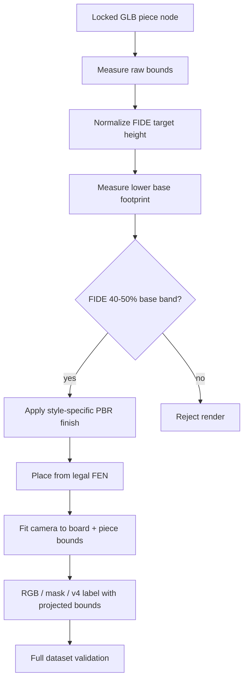

## Goal Capsule

Bring the private synthetic-data renderer's asset-backed chess pieces into a tournament-set proportion range, while keeping every rendered board and piece inside the image frame.

The user has authorized design decisions and a full shipped revision of the training corpus.

Stop if the locked source GLB cannot be normalized to the specified profile without distorting its conventional chess silhouettes or if a required FIDE relationship conflicts with the source geometry.

---

## Product Contract

### Summary

The v5 asset-backed sets have much better silhouettes than the earlier procedural models, but their small kings and pawns make a real board look sparse and their tall rook breaks the expected hierarchy.

The new v6 corpus will use one clearly defined professional-set profile across all five material variants, brighter but still dark opposing pieces, and a camera safety check that includes the physical piece bounds.

### Problem Frame

Training images only transfer well when the size, contrast, and framing of physical objects are plausible.

The current mesh adapter scales only total height from ad-hoc values and frames only the board's top-plane corners, so neither a tournament-style proportional relationship nor uncropped tall pieces is guaranteed.

### Requirements

**Professional geometry**

- R1. Piece height follows King > Queen > Bishop > Knight > Rook > Pawn and uses the FIDE reference dimensions normalized against a 57.5 mm midpoint board square: king 1.652, queen 1.478, bishop 1.217, knight 1.043, rook 0.957, pawn 0.870 world units.
- R2. Each uniformly normalized piece base occupies a 40–50% height footprint, with 45% as the target, a one-square safety limit, and no global horizontal mesh distortion. Measure the maximum X/Z span of every mesh vertex in the bottom 18% of the post-normalization world-space height; missing or unmeasurable base geometry rejects the render.
- R3. Every FEN node continues to resolve to the same locked, pre-authored mesh and keeps its authored silhouette.

**Realistic visual contrast**

- R4. Dark-piece base colors have linear-sRGB relative luminance from 0.03 through 0.12 and differ from their matching light material by at least 0.20, while reading as dark walnut, ebony, mahogany, green stone, or blackened brass under the existing indoor lights.
- R5. Non-metal dark pieces have roughness at least 0.28 and clearcoat at most 0.30; blackened brass has roughness at least 0.32 and clearcoat at most 0.14.

**Framing and corpus integrity**

- R6. The full physical board and every rendered piece bound remain inside the required image margin for all camera rigs, and v4 labels record the projected bounds of every piece instance for archived validation.
- R6a. For every visible dark piece with at least 100 mask pixels in the five-style review render, its 95th-percentile linear luminance is at least 0.055 and its maximum luminance difference from the one-pixel exterior mask ring is at least 0.060.
- R7. Labels and render manifests identify this visual-contract revision as `gltf-asset-packs/v4`; archival `v3` datasets remain valid when validated against their existing contract.
- R8. Regenerate a separate full v6 corpus with 50 legal source positions × 5 set variants and validate FEN truth, instance masks, provenance, and framing.

### Scope Boundaries

- Keep the locked, licensed GLB and the existing five board environments; this is a scale/material/framing revision, not a new asset acquisition project.
- Keep the generator private to `training/`; do not add model-generation code or mesh assets to the React PWA.
- Do not claim that synthetic data alone demonstrates real-world recognition accuracy.
- Treat v6 as the canonical FIDE calibration profile. Bounded FIDE-compliant scale variation remains a follow-up dataset axis, after the exact reference profile is validated.

### Acceptance Examples

- AE1. A normalized set has a 1.652-unit king, 0.870-unit pawn, and a 0.430-unit rook base target with a 0.383–0.478 allowed FIDE band.
- AE2. A black ebony piece remains recognizably dark but retains visible form under a neutral-studio light rather than collapsing to a pure-black silhouette.
- AE3. A low oblique image containing a tall edge king keeps the board frame and the complete king inside the 32-pixel safety margin.
- AE4. A 250-artifact v6 run validates without accepting a mixed `v3`/`v4` manifest.

---

## Planning Contract

### Key Technical Decisions

- KTD1. Use the FIDE 2026 tournament dimensions and a 57.5 mm square midpoint as the scene-scale reference (session-settled: user-directed — chosen over ad-hoc visual scaling: the request requires professional-standard proportions).
- KTD2. Measure all transformed mesh vertices in the bottom 18% of each uniformly normalized root and use the maximum X/Z span as its base diameter. Enforce the 40–50% FIDE range as an acceptance gate; do not apply a global X/Z correction, because it would distort the pre-authored silhouette.
- KTD3. Treat camera safety as the union of board-frame and generated piece bounds, and write per-instance projected bounds into v4 labels for archive-time validation.
- KTD4. Bump the renderer contract to `gltf-asset-packs/v4` and write the new full run to `training/output/dataset-v6-final`; never resume or overwrite v5 output after material/geometry changes.
- KTD5. Lift dark albedo values and enforce the R4/R5 material limits rather than adding a brightness post-process. This keeps color differences physical and deterministic in both RGB and masks.
- KTD6. Add a mask-assisted smoke-render quality gate for dark pieces. Configuration limits prevent near-black source materials; rendered-pixel thresholds catch retained source maps, shadows, and exposures that could still create unreadable silhouettes.

### High-Level Technical Design

### Assumptions

- A 57.5 mm reference square, the midpoint of FIDE's 50–60 mm guidance, is appropriate for synthetic world units where each square has width 1.
- An 18%-of-height lower band contains the base but excludes the knight head and crown for the locked set; its maximum X/Z vertex span is a reproducible diameter proxy.
- Existing board/mask truth formats need no class-vocabulary change; the model-version provenance distinguishes the revision.

### Sources & Research

- [FIDE Handbook: Chess Equipment without Electronic Components](https://handbook.fide.com/chapter/ChessEquipmentWithoutElectronicComponenets032026) specifies 50–60 mm squares, the six-piece height order and nominal dimensions, 40–50% base diameter, dark-but-contrasting colours, and a matte/non-excessively-shiny finish.
- `training/scene/gltf-piece-factory.mjs` is the normalization boundary for all locked FEN mesh nodes.
- `training/scene/board-scene.mjs` contains the existing full-board camera safety contract.

---

## Implementation Units

### U1. Encode and test the FIDE geometry profile

- **Goal:** Make target height, base diameter, and base safety explicit and measurable for every asset-backed FEN piece.
- **Requirements:** R1, R2, R3, AE1.
- **Dependencies:** None.
- **Files:** `training/scene/gltf-piece-factory.mjs`, `training/renderer/main.mjs`, `training/renderer/asset-profile-preflight.mjs`, `training/tests/renderer-contract.node-test.mjs`, `training/package.json`.
- **Approach:** Export a pure geometry-profile and normalization/measurement seam. After applying each root's world transform, select all mesh vertices within the bottom 18% of its measured height and use the maximum X/Z span as its footprint diameter. Normalize uniformly, reject a source node outside the 40–50% FIDE band or a one-square footprint, and record final dimensions on instance metadata. Add a browser-backed locked-GLB preflight that checks all twelve mapped nodes after the ignored cache is verified.
- **Patterns to follow:** Existing `FEN_ASSET_NODE_NAMES`, `centreOnBoard`, and Node-based renderer contract tests.
- **Test scenarios:** Verify all six target heights and strict FIDE ordering; synthetic mesh fixtures apply nested transforms, normalize to target height, and use only lower-band vertices for an in-band base diameter; a 45%-target rook resolves to 0.430 units within the 0.383–0.478 allowed band; malformed, out-of-band, or unmeasurable geometry fails; every measured base fits a one-unit square; the browser preflight loads all twelve cached nodes and records compliant locked-asset dimensions.
- **Verification:** The focused renderer contract proves the numerical profile and `test:asset-profile` proves the actual cached GLB before any smoke/full rendering.

### U2. Render realistic, distinguishable dark finishes

- **Goal:** Replace near-black albedo/clearcoat values with material-specific dark finishes that retain readable contour under bounded lighting.
- **Requirements:** R4, R5, AE2.
- **Dependencies:** U1.
- **Files:** `training/scene/piece-factories.mjs`, `training/scene/gltf-piece-factory.mjs`, `training/renderer/render-quality.mjs`, `training/tests/renderer-contract.node-test.mjs`, `training/tests/render-quality.node-test.mjs`.
- **Approach:** Adjust the five `materials.black` values toward dark brown, charcoal-green stone, and blue-gray metal; enforce the R4 linear-sRGB luminance band and light/dark separation, plus the R5 per-surface roughness and clearcoat limits. Preserve the locked GLB geometry, authored detail maps, and style identity.
- **Patterns to follow:** `CHESS_SET_SPECS` and the material clone path in `applySetFinish`.
- **Test scenarios:** Every black material is valid hexadecimal color data, has a 0.03–0.12 linear-sRGB luminance, differs from its light companion by at least 0.20, meets the R5 finish limits, and each set retains a distinct board/silhouette/material identity; synthetic RGB/mask fixtures prove the per-piece R6a percentile and exterior-ring calculation accepts readable contrast and rejects a near-black silhouette.
- **Verification:** The focused test passes and an actual five-style render passes the mask-assisted R6a check before visual inspection.

### U3. Frame the complete rendered scene and version the contract

- **Goal:** Guarantee that taller v4 pieces cannot be cropped while preserving the full-board capture requirement and clear archival separation from v3.
- **Requirements:** R6, R7, AE3, AE4.
- **Dependencies:** U1, U2.
- **Files:** `training/scene/board-scene.mjs`, `training/renderer/main.mjs`, `training/renderer/run-render.mjs`, `training/validate-dataset.mjs`, `training/tests/renderer-contract.node-test.mjs`, `training/tests/validate-dataset.node-test.mjs`, `training/README.md`.
- **Approach:** Project all eight corners of the physical board bounds and each placed piece's `Box3`; expand camera distance until their union is inside the existing margin. Emit a v4 `camera.projected_piece_bounds` record keyed by instance ID, validate its margin and correspondence to each label piece, emit the v4 model version in labels/manifests, accept v3/v4 provenance for archive validation, and require each label to match the manifest version.
- **Patterns to follow:** `validateBoardInFrame`, render run identity comparisons, and current v3 provenance tests.
- **Test scenarios:** A camera that passes the board-only check but crops an edge/tall piece is rejected; deterministic rig samples fit all scene bounds; each v4 label has a complete, margin-safe projected bound for every instance and its visible mask box lies within that projected bound; a label/manifest model-version mismatch fails; an archival v3 fixture remains accepted.
- **Verification:** Focused renderer and validator suites exercise both framing and version compatibility.

### U4. Produce and inspect the v6 corpus

- **Goal:** Deliver the revised private training data without changing the app bundle or corrupting prior corpus outputs.
- **Requirements:** R6a, R8, AE1, AE2, AE3, AE4.
- **Dependencies:** U1, U2, U3.
- **Files:** `training/README.md`, `training/output/dataset-v6-final/` (ignored generated output only).
- **Approach:** Run cached-asset preflight first, then render the existing 50 legal source FENs sequentially in deterministic batches into a clean `dataset-v6-final` directory. Validate every artifact, run the mask-assisted quality check against the five-style review corpus, and inspect representative low, overview, dark-wood, stone, and metal results before treating the corpus as trainable.
- **Execution note:** Prefer a real browser-render smoke corpus before the full regeneration; the data path is WebGL-dependent.
- **Test scenarios:** A five-style smoke output validates; the full run contains exactly 250 artifacts, one of each style for every source; no unreferenced file or mixed model version appears.
- **Verification:** Full validator completes against `dataset-v6-final` and visual inspection confirms proportion, dark-piece readability, and uncut board/pieces.

---

## Verification Contract

| Scope | Evidence | Done signal |
|---|---|---|
| U1–U3 | `npm --prefix training run test:renderer` | Geometry, material, camera, and provenance contracts pass. |
| U3 | `npm --prefix training run test:validate` | v3 archive and v4 current labels/manifests validate at their contract boundaries. |
| U1–U4 | `npm --prefix training run test:assets`, `npm --prefix training run test:asset-profile`, and `npm --prefix training test` | Locked asset, post-normalization dimensions, and source-selection safeguards remain intact. |
| U2/U4 | Five-style browser smoke plus `render-quality.mjs` | Every eligible dark piece meets the R6a pixel-luminance and exterior-ring threshold. |
| U4 | Browser render smoke plus full `validate-dataset.mjs --full` run for `dataset-v6-final` | 250 RGB/mask/label artifacts are FEN-accurate, provenance-complete, and in frame. |
| App regression | `npm run typecheck`, `npm test`, `npm run build` | The private training update does not break the cross-platform PWA. |

---

## Definition of Done

- All asset-backed pieces follow the FIDE target order and normalized dimensions, with 40–50% base ratios, no base outside a square, and no global horizontal mesh distortion.
- The five dark-piece finishes are visibly differentiated and avoid near-black, overly glossy silhouettes.
- Scene framing proves every board and placed piece bound remains inside the existing safety margin.
- `gltf-asset-packs/v4` labels and manifests cannot mix with v3 output; v3 archive validation remains supported.
- `training/output/dataset-v6-final` contains a validated 50 × 5 corpus and representative rendered images have been inspected.
- Focused and root regression checks pass, and abandoned experimental code is not left in the branch.
