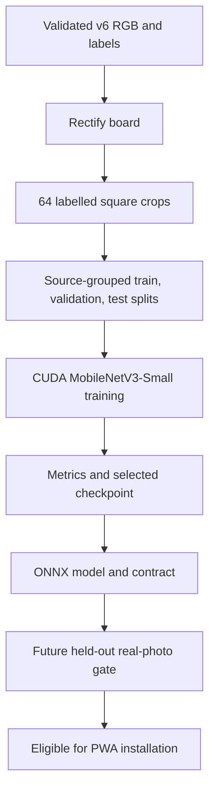
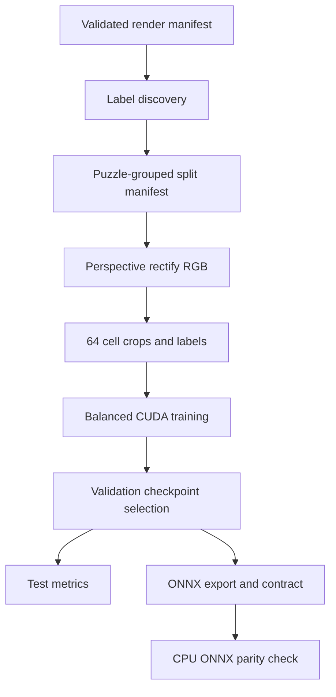

# GPU Chess Recognition Baseline - Plan

## Goal Capsule

- **Objective:** Train a reproducible GPU baseline that turns a confirmed, rectified chessboard into 64 ordered predictions from the existing 13-class chess vocabulary.
- **Product authority:** A complete board and the correction-first flow remain mandatory. The user directed that a model be trained now and that its training use the GPU rather than CPU fallback.
- **Open blockers:** Synthetic-only evaluation cannot establish real-board accuracy, so trained weights remain a developer artifact until a held-out real-photo evaluation is added.

---

## Product Contract

### Summary

Chess Vision will gain a private, GPU-trained baseline for recognising every square on a confirmed board. The baseline will be portable for later browser inference, but the PWA will not claim real-world recognition is ready from synthetic validation alone.

### Problem Frame

The validated v6 corpus provides exact labels, but it has only 50 independent puzzle positions. The existing app has a calibrated 64-square recognition seam, while the legacy YOLO detector has incompatible labels and does not model empty squares.

### Requirements

**Training data**

- R1. Train only from a fully validated v6 render directory and preserve its source, renderer, and split provenance with the experiment.
- R2. Derive 64 white-at-bottom square crops from every full-board image using the renderer's board geometry and retain the existing ordered 13-class vocabulary.
- R3. Split by source puzzle identity before expanding a board into square crops, so no visual variant of a position leaks across train, validation, or test.

**Model and training**

- R4. Train a compact MobileNetV3-Small transfer-learning classifier with 13 output classes on CUDA and fail the run if CUDA is unavailable.
- R5. Counter empty-square and piece-class imbalance during training and report per-class precision, recall, F1, and a source-disjoint aggregate score.
- R6. Record deterministic seeds, device identity, library versions, dataset hashes, hyperparameters, checkpoints, and the selected validation checkpoint.

**Artifacts and safety**

- R7. Export an ONNX model plus a machine-readable model contract that pins class order, 96-pixel input crops, white-at-bottom traversal, and RGB normalization.
- R8. Keep model outputs, extracted crops, checkpoints, and reports below ignored training output paths; no private renderer or training dependencies enter the PWA bundle.
- R9. Document a future real-photo evaluation gate before an exported model can be installed into the PWA's public model directory.

### Key Decisions

- **Use a 64-cell classifier, not a whole-image detector.** The app already rejects incomplete boards and rectifies a confirmed board, so its constrained input removes the need for detector-style board localisation and includes the required empty-square class.
- **Use MobileNetV3-Small transfer learning.** Its 2.5M-parameter mobile architecture has enough visual capacity for piece silhouettes while fitting a 4 GB RTX 3050 Ti training budget and a later on-device browser target.
- **Use PyTorch CUDA training and ONNX export.** The installed TensorFlow and PyTorch packages are CPU-only on this Windows host; CUDA-enabled PyTorch is the supported practical training path, while ONNX is portable to later browser inference.
- **Keep the synthetic baseline private.** Synthetic metrics prove pipeline integrity, not recognition on physical boards. The correction-first app remains honest until real-photo evaluation passes. (session-settled: user-directed — chosen over presenting synthetic-only recognition as ready: the existing product contract requires a real-photo gate.)

### Acceptance Examples

- AE1. **Covers R2, R3.** Given five renders of one puzzle, every one is assigned to the same split and produces 64 crops in `a8` through `h1` order.
- AE2. **Covers R4, R6.** Given the RTX GPU is available, a training run records CUDA device identity and refuses to continue if the selected device is CPU.
- AE3. **Covers R7, R8.** Given a selected checkpoint, export writes a model and contract inside the ignored training output tree without adding model binaries to the PWA.

### Success Criteria

- The GPU run completes with a source-disjoint test report and non-empty per-class metrics.
- The selected model and its contract pass structural verification and can be evaluated by a CPU ONNX smoke check.
- No source puzzle appears in more than one split, and no generated training artifact is staged for Git.

### Scope Boundaries

- **In scope:** Private GPU training, reproducible data preparation, metrics, ONNX export, model contract, and documentation.
- **Deferred for later:** Additional rendered positions, separately annotated real-photo evaluation, model calibration on real boards, and automatic board-corner detection.
- **Outside this baseline:** Replacing the user-confirmed calibration flow, reusing the incompatible legacy YOLO labels, or presenting synthetic-only accuracy as a production recognition claim.

### Dependencies / Assumptions

- The validated `training/output/dataset-v6-final` corpus is present locally.
- CUDA-enabled PyTorch wheels remain available for Python 3.9 on Windows and can access the installed RTX 3050 Ti.

### Sources / Research

- `docs/plans/2026-07-17-002-fix-training-pipeline-plan.md` establishes the calibrated 64-cell, 13-class product boundary.
- `training/README.md` and `training/validate-dataset.mjs` define the validated v6 render contract.
- [PyTorch MobileNetV3 documentation](https://docs.pytorch.org/vision/master/models/mobilenetv3.html) documents the small mobile model family.
- [ONNX Runtime Web documentation](https://onnxruntime.ai/docs/get-started/with-javascript/web.html) documents portable browser inference for a later integration step.

---

## Planning Contract

**Product Contract preservation:** Product Contract unchanged.

### Key Technical Decisions

- KTD1. Use the existing calibrated 64-cell, 13-class product contract rather than the legacy YOLO detector. This retains empty-square prediction, white-at-bottom ordering, and correction-first interaction.
- KTD2. Use `torchvision` MobileNetV3-Small with ImageNet initialization, a 96×96 RGB crop, and a 13-logit head. The full 2.5M-parameter mobile architecture fits the 4 GB CUDA device without compromising a later browser deployment target.
- KTD3. Rectify the rendered outer board frame to 512×512, then crop the 8×8 playable grid with a small bounded context margin. The synthetic crop geometry mirrors `src/lib/boardGeometry.ts` rather than learning camera perspective twice.
- KTD4. Use deterministic, source-grouped split search that requires every vocabulary class in validation and test. Split identity is `source.puzzle_id`; style, lighting, and camera variants are never independent examples.
- KTD5. Require CUDA in the training CLI and use a CUDA 12.8 PyTorch build on this Windows/Python 3.9 machine. A CPU-only dependency or run is an error, not a fallback.
- KTD6. Export ONNX with a versioned JSON contract into ignored `training/output/models/`. ONNX is a private interchange artifact for this baseline, not an app-runtime choice; keep the PWA's TensorFlow.js seam unchanged until a separately annotated real-photo gate validates the new contract, then choose TensorFlow.js conversion or ONNX Runtime Web together with a preprocessing/output adapter.
- KTD7. Preserve the correction-first real-photo safety gate (session-settled: user-directed — chosen over synthetic-only recognition availability: the product must not claim physical-board accuracy without real-photo evaluation).
- KTD8. Canonicalise renderer corners explicitly: `projected_board_corners` are `[a1, h1, h8, a8]`; reorder source indices `[3, 2, 1, 0]` so the white-at-bottom warp maps `[a8, h8, h1, a1]` to canonical top-left, top-right, bottom-right, bottom-left.
- KTD9. Pin the CUDA 12.8 runtime in `training/requirements-ml.txt` to `torch==2.8.0+cu128` and `torchvision==0.23.0+cu128` from the official CUDA index, use `MobileNet_V3_Small_Weights.IMAGENET1K_V1`, and record resolved package/weight provenance in each report.

### High-Level Technical Design

### Assumptions

- The local `dataset-v6-final` run remains the baseline input and continues to pass the existing full validator.
- The CUDA 12.8 wheel is compatible with the installed NVIDIA driver. The preflight records its device name and fails before data preparation if that assumption is false.
- The first baseline is an experiment artifact, not a production-release model. A later real-photo set will determine whether it can be copied into `public/models/`.

### Risks and Mitigations

| Risk | Mitigation |
| --- | --- |
| 50 source positions overfit despite 16,000 crops | Keep puzzle groups intact, report source-disjoint metrics, and label the result synthetic-only. |
| Empty squares dominate the loss | Use a deterministic class-balanced sampler and report per-class, macro, and board-level metrics. |
| CUDA package regressions silently train on CPU | Require `torch.cuda.is_available()`, store device evidence, and fail the command otherwise. |
| Renderer geometry drifts from app rectification | Derive crop geometry from the renderer frame contract and test the square traversal and crop bounds. |
| Renderer corner ordering is misread | Use the fixed `[3, 2, 1, 0]` source reorder and a fixture proving `a8` is the canonical top-left crop and `h1` the bottom-right crop. |
| Edited inputs bypass corpus validity checks | Run the existing full validator against its explicit source and render manifests before label discovery and preserve its result/hashes. |
| Export changes numerical predictions | Run ONNX Runtime parity against the selected PyTorch checkpoint before accepting the artifact. |

---

## Implementation Units

### U1. Define the private square-classifier contract

- **Goal:** Establish one versioned vocabulary, crop geometry, normalization policy, and artifact schema for the trainer and exporter.
- **Requirements:** R2, R7, R8; KTD1, KTD3, KTD6, KTD8.
- **Dependencies:** None.
- **Files:** `training/ml/__init__.py`, `training/ml/contract.py`, `training/tests/test_ml_contract.py`.
- **Approach:** Express the 13 class names, `a8`–`h1` traversal, outer-frame margin, 96-pixel crop shape, and ImageNet normalization as data shared by the preparation, training, export, and verification paths. Validate model-contract JSON before it is written.
- **Patterns to follow:** `training/scene/labels.mjs` for vocabulary order; `src/lib/boardGeometry.ts` for complete-board, white-at-bottom rectification.
- **Test scenarios:** The contract keeps all 13 class IDs in their current order; the 64-square traversal starts at `a8` and ends at `h1`; crop bounds stay inside a 512-pixel rectification; malformed or reordered model contracts fail validation.
- **Verification:** Python tests prove contract shape and deterministic crop coordinates.

### U2. Turn validated renders into source-grouped square samples

- **Goal:** Load only validated synthetic labels, create leak-free source splits, and rectify/crop board images lazily for training.
- **Requirements:** R1, R2, R3, R6; KTD3, KTD4, KTD8.
- **Dependencies:** U1.
- **Files:** `training/ml/dataset.py`, `training/ml/prepare.py`, `training/tests/test_ml_dataset.py`, `training/requirements-ml.txt`.
- **Approach:** Resolve the render manifest's `source_manifest` relative to its parent, require that source manifest to exist, and run `validate-dataset.mjs --full` before label discovery. Record validator arguments/result plus hashes of the source manifest, render manifest, labels, and RGB files. Associate all visual variants with `source.puzzle_id`, search deterministically for 80/10/10 source groups with vocabulary coverage, write a split manifest, and warp RGB images by reordering renderer corners `[a1, h1, h8, a8]` to source indices `[3, 2, 1, 0]`, which maps `[a8, h8, h1, a1]` onto the canonical white-at-bottom frame before extracting each labelled crop.
- **Execution note:** Add characterization tests for split integrity before allowing the training command to process a full corpus.
- **Patterns to follow:** `training/validate-dataset.mjs` for manifest/label provenance and strict input boundaries.
- **Test scenarios:** Five variants of one puzzle land in one split; each split has a non-empty sample for every class; a missing RGB, source manifest, or invalid corner order fails clearly; a fixture proves `a8` maps to the top-left crop and `h1` to the bottom-right; source/renderer/model provenance and validator evidence are retained in the split manifest.
- **Verification:** Python tests and a preparation-only run produce deterministic split counts without writing outside `training/output/`.

### U3. Train and evaluate the CUDA baseline

- **Goal:** Fine-tune MobileNetV3-Small on the prepared samples, select a validation checkpoint, and report source-disjoint performance.
- **Requirements:** R4, R5, R6; KTD2, KTD4, KTD5, KTD9.
- **Dependencies:** U1, U2.
- **Files:** `training/ml/train.py`, `training/ml/metrics.py`, `training/tests/test_ml_metrics.py`, `training/tests/test_ml_train.py`, `training/requirements-ml.txt`.
- **Approach:** Preflight CUDA before data loading, seed Python/NumPy/PyTorch deterministically, use the pinned `MobileNet_V3_Small_Weights.IMAGENET1K_V1` artifact, use a balanced sampler and augmentation that preserves square semantics, select by validation macro F1, then evaluate the chosen checkpoint once on the held-out puzzle groups. Persist a JSON report with class counts, per-class metrics, device/library/weight identity, dataset and split hashes, and hyperparameters.
- **Execution note:** Use mixed precision and a 4 GB-safe batch size; reduce the batch size only after a real CUDA out-of-memory report.
- **Patterns to follow:** `training/source/puzzle_selector.py` for deterministic seeded work and provenance output.
- **Test scenarios:** `test_ml_train.py` proves CUDA preflight rejects CPU-only Torch; balanced sampling produces all classes; metric aggregation returns defined values for every class; checkpoint selection uses validation only; source IDs from test never occur in train or validation reports.
- **Verification:** A real GPU run records the RTX device, produces a selected checkpoint, and writes non-empty validation/test metrics.

### U4. Export and verify a portable experiment artifact

- **Goal:** Export the selected checkpoint to ONNX and prove its inference signature agrees with the training model.
- **Requirements:** R7, R8, R9; KTD6, KTD7, KTD9.
- **Dependencies:** U1, U3.
- **Files:** `training/ml/export.py`, `training/ml/verify_export.py`, `training/tests/test_ml_export.py`, `training/README.md`, `public/models/README.md`.
- **Approach:** Export a dynamic-batch ONNX graph with a named NCHW RGB input and 13-logit output, write the contract beside it, run an ONNX Runtime CPU parity check on deterministic representative crops, and document that the artifact remains private until a real-photo gate authorizes a separate runtime/adapter decision for PWA installation.
- **Patterns to follow:** `public/models/README.md` for the existing app-facing model boundary; `training/VALIDATION.md` for private artifact guarantees.
- **Test scenarios:** Export contract references only files inside its experiment directory; input/output shapes match the contract; ONNX logits match PyTorch within numerical tolerance; a synthetic-only report cannot be marked PWA-eligible.
- **Verification:** Export verification emits a pass report beside the selected ONNX artifact and the app build remains unchanged.

### U5. Make the baseline reproducible for developers

- **Goal:** Give developers a single documented GPU workflow for validate, prepare, train, export, and inspect without widening the PWA bundle.
- **Requirements:** R1, R6, R8, R9.
- **Dependencies:** U2, U3, U4.
- **Files:** `training/README.md`, `training/ml/README.md`.
- **Approach:** Document installation from the pinned CUDA wheel index, explicit GPU preflight, private output layout, required v6 validation, experiment provenance, and the real-photo promotion gate. Keep generated models and reports ignored.
- **Test scenarios:** Documentation commands point to existing scripts; repository status remains free of generated models after a training run; source, app, and renderer test suites retain their current commands.
- **Verification:** A clean environment can reproduce the baseline run and report its GPU model/device provenance.

---

## Verification Contract

| Scope | Evidence | Done signal |
| --- | --- | --- |
| U1–U2 | `python -m unittest discover -s training/tests -p "test_ml_*.py"` | Contracts, source grouping, and crop geometry are deterministic. |
| U3 | GPU training CLI against `training/output/dataset-v6-final` | Report records `cuda:0`, the RTX name, source-disjoint metrics, and selected checkpoint. |
| U4 | ONNX verification CLI | Exported graph input/output and logits match the selected PyTorch checkpoint. |
| Existing data | Full dataset validator and dark-piece quality gate | Baseline input remains provenance-complete and readable. |
| App regression | `npm run typecheck`, `npm test`, `npm run build` | Private training work does not alter the PWA bundle or correction-first fallback. |

## Definition of Done

- A CUDA-only MobileNetV3-Small training run finishes against the validated v6 corpus and emits a reproducible experiment report.
- The selected model is exported to ONNX with a verified machine-readable contract and source-disjoint metrics.
- Tests protect the vocabulary, crop geometry, split isolation, metrics, CUDA preflight, and export contract.
- Documentation explains GPU setup and makes the real-photo promotion gate explicit.
- Training artifacts remain ignored, while the source, tests, plan, and documentation are ready to commit.
