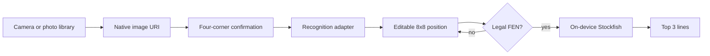

# React Native Migration - Plan

## Goal Capsule

**Objective:** Replace the browser PWA with a downloadable Android and iOS React Native application that keeps Chess Vision's capture, correction, and analysis workflow.

**Product authority:** The user directed a React Native replacement and authorized the implementation choices needed to deliver it. The existing training pipeline remains developer-only infrastructure.

**Open blockers:** Store-signed release binaries require the account credentials and hosted build access of their eventual publisher. This migration must leave the project ready for those builds without fabricating a release artifact.

## Product Contract

## Summary

Chess Vision will become a native React Native app for iPhone and Android. It will capture or import a board photo, require confirmation of the full board outline, let the player correct every square, and analyse the corrected position with three local engine lines.

## Problem Frame

The current application presents a mobile-shaped interface but is a Vite PWA. Its capture, calibration, model-loading, and Stockfish paths rely on browser file inputs, DOM canvases, web workers, and PWA assets, so it is not the downloadable native app the product now requires.

The current trained classifier is private and synthetic-only. Treating it as a reliable camera recogniser would create false confidence when real-board performance has not been evaluated.

## Key Decisions

- **Use Expo-managed React Native with native development builds.** React Native satisfies the requested iOS and Android delivery surface; a development build is required because the engine runs through a native module rather than a browser worker. This is the one migration constraint worth challenging up front: the app will not be a web target or run in Expo Go, which is compatible with the native-store goal.
- **Keep correction as the truth boundary.** Camera recognition remains a deliberately replaceable seam until a real-photo-validated model and mobile inference adapter exist. A user must always be able to inspect and correct the position before engine analysis.
- **Run Stockfish on-device.** Analysis must use a native Stockfish adapter and return up to three principal variations without a server round-trip.
- **Preserve training as private tooling.** The synthetic renderer, datasets, model outputs, and training scripts remain outside the mobile bundle and user-facing app surface.

## Actors

- A1. **Chess player:** captures or imports a full-board photo, corrects the interpreted position, and requests engine analysis.
- A2. **Native app:** requests permissions, records the confirmed board outline and orientation, presents the correction board, validates FEN, and manages engine state.
- A3. **On-device engine:** evaluates a confirmed legal FEN and returns the best three principal variations.
- A4. **Dataset maintainer:** trains and evaluates a future recognition model separately from the shipped application.

## Requirements

**Native delivery**

- R1. The project must build a React Native application for Android and iOS and remove the Vite/PWA runtime, service-worker setup, React DOM entrypoint, and browser-only engine assets.
- R2. The app must expose development, preview, and production build configuration with stable Android package and iOS bundle identifiers.
- R3. The native interface must preserve Chess Vision's dark, chess.com-adjacent visual language without relying on browser CSS.

**Capture and position correction**

- R4. A player must be able to take a photo with the device camera or select one from the device library, with clear permission and failure feedback.
- R5. Before analysis, a player must mark the four outside board corners, choose the board orientation, and affirm that the complete physical board is visible.
- R6. The app must present an editable 8x8 board, support selecting a piece type and assigning or clearing squares, and display the resulting FEN.
- R7. The app must reject malformed or illegal positions before asking the engine to analyse them.

**Recognition and analysis**

- R8. Recognition must have an explicit native adapter contract and must fall back to an empty, editable board with transparent messaging while no real-photo-qualified model is bundled.
- R9. A confirmed legal FEN must be analysed locally with Stockfish at a bounded depth and return the top three principal variations, each with a readable evaluation and move sequence.
- R10. Engine cancellation, errors, and screen unmounting must not leave a native engine process running or make the app unresponsive.

**Quality and contributor workflow**

- R11. The migration must preserve the existing private training workflow and its synthetic-only model contract.
- R12. Logic that validates positions, calibration state, recognition fallback, and engine output parsing must be covered by automated tests.
- R13. The README must explain native development, development-build limitations, validation commands, and the remaining path from configuration to App Store and Google Play publication.

## Key Flows

### F1. Capture to correction

**Trigger:** A player taps Camera or Photo library.

The app obtains a native image URI, displays it under four movable corner handles, records the selected orientation, and enables Continue only after the player confirms that all board edges are visible. Recognition then returns either its native result or an explicitly labelled editable fallback.

### F2. Correct to analyse

**Trigger:** A player has reviewed the board.

The player edits pieces or FEN until the position validates. The app sends the confirmed FEN to the local engine, displays up to three ranked lines, and allows a new photo or correction without retaining stale analysis.

### F3. Native failure handling

**Trigger:** A permission request, engine operation, or recognition attempt fails.

The app explains the failure in the current screen, preserves a recoverable correction path where possible, and releases engine work when the analysis screen is left.

## Acceptance Examples

- AE1. **Covers R4, R5.** Given a player declines camera permission, the app explains how to use the photo library or enable permission and does not show a fictitious capture result.
- AE2. **Covers R5, R8.** Given a player selects a photo that has the full board in view, they can set all four corners and orientation, then reach an editable empty board labelled as manual correction when no qualified model is installed.
- AE3. **Covers R6, R7.** Given a player builds a board with a missing king, the Analyse action reports the validation problem and does not start Stockfish.
- AE4. **Covers R9, R10.** Given a legal corrected FEN, the app shows three ordered engine lines; leaving or cancelling the analysis returns control promptly and stops the outstanding search.

## Scope Boundaries

**Deferred for later**

- Bundling automatic piece recognition before it has passed held-out real-photo evaluation.
- App Store and Google Play submission, signing credentials, store listings, analytics, and release operations.
- Cloud engine analysis, accounts, saved games, and multiplayer play.

**Outside this migration**

- Maintaining a PWA or web deployment alongside the native application.
- Moving dataset generation or model-training code into the mobile app.

## Dependencies / Assumptions

- Expo's supported native image picker and a native Stockfish package can be installed in a development build and autolinked into generated Android/iOS projects.
- Store production builds will be created later by an account holder with Apple and Google credentials.
- The native engine package retains a compatible public API and its licensing obligations are reviewed before commercial store submission.

## Sources / Research

- Existing browser delivery and capture contract: `package.json`, `src/App.tsx`, `src/components/BoardCalibration.tsx`, `src/services/recognition.ts`, and `src/services/stockfish.ts`.
- Existing model boundary: `training/README.md` and `training/ml/contract.py`.
- [Expo development builds](https://docs.expo.dev/develop/development-builds/introduction/) and [custom native code guidance](https://docs.expo.dev/workflow/customizing/).
- [Expo ImagePicker](https://docs.expo.dev/versions/latest/sdk/imagepicker/) and [@udaychauhan/react-native-stockfish](https://www.npmjs.com/package/@udaychauhan/react-native-stockfish).

## Planning Contract

### Requirements Trace

| Requirement | Planned coverage |
| --- | --- |
| R1-R3 | U1, U6 |
| R4-R5 | U2 |
| R6-R7 | U3 |
| R8 | U4 |
| R9-R10 | U5 |
| R11-R13 | U1, U4, U6 |

### Technical Direction

- Use Expo SDK 57 and TypeScript as the native project foundation. This removes browser runtime dependencies instead of wrapping the PWA in a WebView.
- Use Expo ImagePicker for camera and photo-library acquisition. Pass the native `uri`, dimensions, and media metadata through a small capture contract.
- Preserve the manual four-corner gate natively. The current model needs a rectified board image, but no mobile model runtime is bundled; the capture contract therefore retains the corner data and full-board affirmation without fabricating a model result.
- Use `chess.js` as the legal-position authority. Render the native 8x8 board and palette in React Native so correction remains independent from recognition.
- Use the native Stockfish package behind a hook. Normalise UCI `info` lines into app-owned analysis types, request MultiPV 3 at depth 14, and tear down on cancellation or unmount.
- Use `jest-expo` for pure logic and React Native component tests. Retire Vite's split TypeScript configuration and Vitest configuration in favour of one Expo TypeScript config and a Jest setup.
- Configure EAS profiles and native identifiers. The repository is build-ready but not store-signed because publication credentials remain intentionally out of source control.

### Compatibility and Migration

- Replace the Vite web entrypoint, PWA plugin, service-worker configuration, browser styles, TF.js adapter, and browser Stockfish bundle. Do not retain a web fallback.
- Retain `training/` unchanged. It is a separate developer workflow, and the resulting model remains private/synthetic-only until real-photo validation allows promotion.
- Preserve the recognizable product flow and chess.com-adjacent palette: capture first, calibration confirmation, correction, then engine lines.

### Risks and Mitigations

| Risk | Mitigation |
| --- | --- |
| A native Stockfish package needs generated native projects and cannot run in Expo Go. | Include `expo-dev-client`, document development-build use, and verify JS bundle/config locally. |
| No Android SDK or macOS/Xcode host is available locally. | Validate TypeScript, tests, Expo config, and iOS/Android export locally; require a development-build compile and Stockfish smoke test in EAS/CI before a preview or production build is accepted. |
| The synthetic-only classifier would create misleading recognition output. | Keep a typed, tested unavailable adapter with a correction-first message and no bundled weights. |
| Photo layouts vary and may not expose all board edges. | Require four draggable corners plus an affirmative full-board control before correction or analysis. |

## Implementation Units

### U1. Establish the native Expo application shell

**Goal:** Replace the PWA runtime with an Expo React Native project that has stable mobile identifiers and development-build support.

**Covers:** R1, R2, R3, R11, R13.

**Dependencies:** None.

**Files:** `package.json`, `app.json`, `eas.json`, `babel.config.js`, `tsconfig.json`, `jest.config.js`, `jest.setup.ts`, `App.tsx`, `src/theme.ts`, `README.md`, plus removal of `vite.config.ts`, `index.html`, `tsconfig.app.json`, `tsconfig.node.json`, browser CSS/entrypoints, PWA assets, and browser-only build scripts.

**Approach:** Install only the native runtime packages needed by the initial app, pin the selected native Stockfish package version, and add `jest-expo` plus React Native Testing Library. Configure Expo, permissions, identifiers, and EAS profiles. Add a compact native shell with a chess.com-inspired palette and clear lifecycle status. Remove web-specific files and dependencies so the project cannot accidentally ship the old PWA.

**Test scenarios:** Expo config resolves Android and iOS identifiers; TypeScript can import the root app without React DOM or Vite types; the Jest/React Native test setup discovers a smoke test; native scripts are discoverable from `package.json`.

**Verification:** `npm run typecheck`, `npx expo config --type public`, and an Android/iOS JavaScript export.

### U2. Implement native photo capture and board calibration

**Goal:** Let a player acquire a native image and complete the full-board calibration gate with touch controls.

**Covers:** R4, R5, AE1, AE2.

**Dependencies:** U1.

**Files:** `src/components/BoardCalibration.tsx`, `src/components/CapturePanel.tsx`, `src/lib/calibration.ts`, `src/lib/calibration.test.ts`, `src/types/capture.ts`, and `App.tsx`.

**Approach:** Request camera or media-library images through Expo ImagePicker. Present the chosen image with four PanResponder-backed corner handles, a two-choice White-side/Black-side orientation control, edge-confirmation control, validation messages, retake action, and a normalized capture record. Use an explicit `contain` image-content rectangle, source-image dimensions, and EXIF-normalized metadata to map touch coordinates bidirectionally between the displayed image and source pixels. Keep polygon validation independent of screen pixels. Label each control, provide four numeric corner-adjustment alternatives to dragging, keep touch targets at least 44 points, and announce validation feedback.

**Test scenarios:** invalid corner order, concave outline, and insufficient board area are rejected; valid clockwise normalized corners and confirmed outer edges create a calibrated capture; portrait, landscape, and letterboxed content map touch positions to source coordinates correctly; each orientation maps an asymmetric board to the expected canonical a1-h8 direction; cancelled or denied acquisition produces recoverable feedback.

**Verification:** focused calibration tests and `npm run typecheck`.

### U3. Port correction and legal-position validation to native UI

**Goal:** Provide a practical 8x8 native correction board and block engine analysis for invalid chess positions.

**Covers:** R6, R7, AE3.

**Dependencies:** U1.

**Files:** `src/components/ChessBoard.tsx`, `src/components/PiecePalette.tsx`, `src/lib/position.ts`, `src/lib/position.test.ts`, `src/types/chess.ts`, and `App.tsx`.

**Approach:** Reuse chess.js-backed board/FEN logic where possible, but replace DOM grid controls with accessible React Native pressable controls. Use the calibrated orientation to label the board canonically and never infer FEN orientation from display rotation alone. Give every square a label such as `e4, black knight`, expose palette and clear actions through assistive activation, and announce validation and engine status. Reset stale engine lines whenever capture, FEN, or piece assignments change. Surface validation text beside the Analyse control.

**Test scenarios:** piece selection assigns and clears squares; board-to-FEN conversion remains stable; missing kings and illegal FEN values stop analysis; a legal FEN is accepted.

**Verification:** focused position tests, `npm test`, and `npm run typecheck`.

### U4. Keep the recognition boundary truthful on mobile

**Goal:** Define the mobile recognition adapter and preserve a tested correction-first fallback until a real-photo-qualified model is available.

**Covers:** R8, R11, AE2.

**Dependencies:** U2, U3.

**Files:** `src/services/recognition.ts`, `src/services/recognition.test.ts`, `src/types/capture.ts`, `training/README.md`, and `README.md`.

**Approach:** Replace the browser `File`, `Blob`, `fetch`, and TF.js assumptions with native capture types. Return a deliberate unavailable result with an empty editable board and a message that tells the player what happened. Do not copy model weights, import training code, or imply that the synthetic model has real-photo performance.

**Test scenarios:** unconfirmed capture returns an error; confirmed capture returns the documented unavailable fallback; no app import reaches `training/`.

**Verification:** focused recognition tests, repository import search, and `npm run typecheck`.

### U5. Integrate native Stockfish analysis

**Goal:** Evaluate legal corrected positions locally and render three readable principal variations without orphaned engine work.

**Covers:** R9, R10, AE4.

**Dependencies:** U1, U3.

**Files:** `src/hooks/useStockfishAnalysis.ts`, `src/services/stockfish.ts`, `src/services/stockfish.test.ts`, `src/components/EngineLines.tsx`, and `App.tsx`.

**Approach:** Wrap the pinned native Stockfish package in an app-owned client interface and React hook that owns engine lifecycle. Send UCI initialization, MultiPV, FEN, and bounded-depth commands. Buffer callback output into complete lines, attach a monotonically increasing search token, and parse only current-search output into typed lines; stop/cancel on replacement and cleanup on unmount. Keep parsing and scoring unit-testable without the native binary. During a search, replace Analyse with an announced Analysing state and a Cancel control; retain correction on cancellation/error, offer Retry after engine failures, and label fewer than three lines as partial results.

**Test scenarios:** UCI output produces correctly ranked lines and human-readable evaluations; fragmented and batched callback output is buffered correctly; malformed output is ignored; cancellation, replacement, delayed output, and unmount requests a stop and block stale results; app-level analysis refuses invalid positions before the hook runs.

**Verification:** focused engine tests, `npm test`, `npm run typecheck`, native bundle export, and a CI/EAS development-build smoke check that initializes Stockfish and analyses a known legal FEN into three lines. If the package fails native compilation, stop publication and replace it only with a version/package that passes the same compatibility gate.

### U6. Document, validate, and prepare store build handoff

**Goal:** Leave a maintainable native repository with verified build metadata and an honest publication handoff.

**Covers:** R2, R3, R11-R13.

**Dependencies:** U1-U5.

**Files:** `README.md`, `eas.json`, `package.json`, native configuration files, and test configuration as required.

**Approach:** Document installation, development builds, Android/iOS run commands, EAS profiles, privacy-facing permission purpose, local validation, training separation, native engine licence/attribution review, and the credential-dependent store release boundary. Run the complete local verification set and correct migration regressions. Add a release checklist that requires the development-build Stockfish smoke evidence before a preview or production build is accepted.

**Test scenarios:** a new contributor can identify the dev-build command and the store-build preconditions; config and exports succeed for both target platforms; no Vite/PWA command or browser asset remains tracked.

**Verification:** `npm test`, `npm run typecheck`, `npx expo config --type public`, `npx expo export --platform android`, `npx expo export --platform ios`, and a repository scan for retired PWA dependencies.

## Verification Contract

- Run focused unit tests while implementing each behavior-bearing unit, then run the full test suite.
- Run TypeScript checking, Jest, and Expo public-config validation after native configuration changes.
- Export JavaScript bundles for Android and iOS to validate Metro resolution without requiring store credentials.
- Inspect the final diff for browser-only imports, training imports from app code, service-worker configuration, and static browser Stockfish assets.
- Require a generated-native-project development-build compile and a Stockfish known-FEN smoke test in CI/EAS before accepting native engine delivery. When that service is unavailable locally, record the gate as pending; do not claim a device or store build passed without its toolchain and credentials.

## Definition of Done

- The repository is an Expo React Native app with no PWA or web runtime remaining.
- A player can select or capture a photo, complete full-board confirmation, correct an 8x8 position, validate it, and request three local engine lines.
- Recognition messaging is truthful while its model remains unqualified for real photos.
- Automated logic tests, TypeScript, Expo config, and both target bundle exports pass.
- The README supplies native development and store-build handoff steps, with store publishing clearly separated from the committed code.
